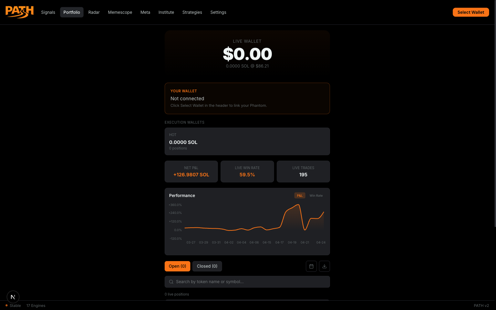
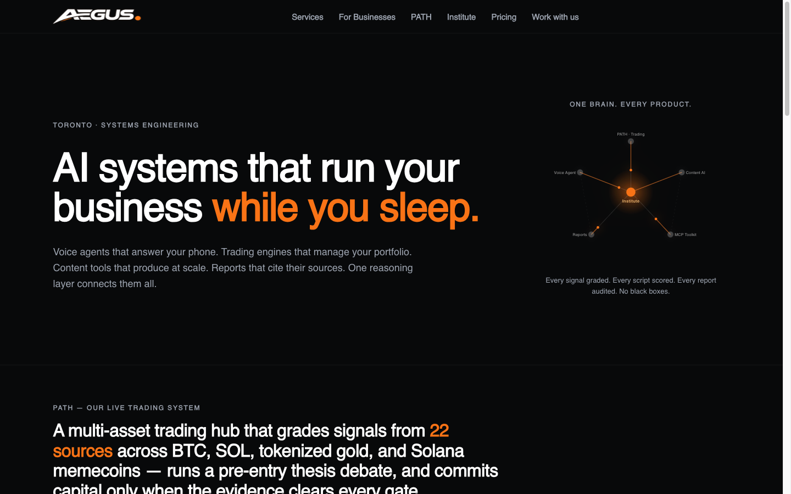

# Hassan Yusuf — Full-Stack Portfolio

Full-stack developer in Toronto, ON. I build end-to-end web applications — **React / Next.js** on the front, **Python / FastAPI** on the back, with an **AI/LLM** layer where it earns its place. I work AI-natively (Cursor, Claude Code) but I own the architecture, the trade-offs, and the debugging.

This repo is a code-honest tour of two things I built and run: **PATH**, a live full-stack web application, and **aegus.digital**, a deployed Next.js site. Everything below describes what the systems actually do.

**Contact:** hassan_yusuf@hotmail.com · github.com/Aegus-dev · [LinkedIn](https://www.linkedin.com/in/hassan-yusuf-tech/) · Eligible to work in Canada (Open Work Permit)

---

## PATH — real-time trading dashboard + backend

A production-grade web app I designed and built end-to-end: frontend, backend, data layer, and an AI layer. It runs 24/7.

**What it is, in plain English.** PATH watches a fast-moving market in real time, scores opportunities against a set of heuristics, applies hard risk gates, and executes on-chain — then manages every open position with its own exit logic. The dashboard is the cockpit: live portfolio, positions, and signals, with operator controls.

### What I owned

- **Frontend** — a real-time dashboard in **Next.js 15, React, TypeScript, and Tailwind**. Live data views and controls, kept current with interval polling against the backend.
- **Backend** — a **Python / FastAPI** service exposing **130+ REST endpoints** (plus a WebSocket broadcast endpoint), driving a fleet of concurrent **async** workers on a single asyncio event loop. Fan-out to external APIs goes through a shared client with per-host rate limits, so one slow upstream never freezes the tick.
- **Data layer** — **SQLite in WAL mode** for concurrent reads without a network round-trip on the write path. One machine, no distributed-DB latency tax.
- **On-chain execution** — Solana trades routed through **Jupiter and PumpPortal with multi-path fallback**, dual submission for landing reliability, and post-submit verification so I act on confirmed fills, not optimistic ones.
- **AI layer** — multi-model **LLM integration (Claude, OpenRouter)** for classification and post-mortems. The LLM is **advisory only**: every money-moving decision is deterministic, rule-based, and auditable. That boundary is deliberate — I don't let a model move capital.
- **Risk gates** — layered, hard refusal rules added incident-by-incident (e.g. retained mint/freeze authority, unlocked liquidity with concentrated holders). Each rule traces back to a specific failure it now prevents.
- **Reliability** — kept it running 24/7 with watchdog auto-restart, liveness probes, and a documented incident → fix → prevention loop.

### Engineering decisions I can defend

- **Deterministic core, advisory AI.** The interesting calls in a trading system are the ones with money attached — those stay in code I can read, test, and audit. The LLM summarizes and classifies; it doesn't decide.
- **Split read and write paths.** Discovery/enrichment is isolated from execution so I can restart or redeploy one side without taking the whole system down, and slow data polls never sit in the critical execution path.
- **Fail closed on risk.** When a class of loss showed up, I wrote a gate that refuses by default rather than tuning a score and hoping. Refusing a bad trade is cheaper than recovering from one.

**Stack:** Next.js 15 · React · TypeScript · Tailwind · Python · FastAPI · asyncio · httpx · SQLite (WAL) · Solana (Jupiter, PumpPortal, Helius RPC) · Claude / OpenRouter · macOS LaunchAgent watchdogs

---

## aegus.digital — live Next.js site

A deployed **Next.js 15 / React / TypeScript / Tailwind** site (App Router) that serves as the public index for everything I build. Live in production on Vercel.

### What I owned

- **~20 routes from a single content model.** Product and quote pages (`/quote/[product]`) are parameterized off shared metadata, so adding a new entry is a data change, not a new template. Less code to drift, one consistent design system.
- **A design system written down, not improvised.** Type scale, spacing, and palette live in a committed `DESIGN.md` so the look survives future changes instead of being re-derived each sprint.
- **Pragmatic responsive fixes.** When the large display type broke at narrow widths, I shipped a targeted heading fallback rather than rewriting the whole type scale — narrowest fix that holds the aesthetic.
- **Automated redeploys.** A scheduled deploy hook keeps the live numbers on product pages in sync with the backend without standing up a full CMS.

**Stack:** Next.js 15 · React · TypeScript · Tailwind · App Router · Vercel

---

## How I work

I'm AI-native: I use Cursor and Claude Code daily, and I'm fast because of it. But the parts that matter — system design, where the boundaries go, which trade-off to take, and why a bug is happening — are mine. I can walk through any decision in this repo and tell you what I tried, what I rejected, and what the incident was that made me add the rule.

I'm currently strengthening **automated testing** (Pytest / Jest) and **cloud deployment** (AWS), and I'm looking to join a Canadian team where I can contribute across the stack and keep growing as an engineer.

---

## Skills

| Area | Tools |
|---|---|
| **Languages** | TypeScript, JavaScript, Python, SQL |
| **Frontend** | React, Next.js 15, Tailwind CSS, HTML/CSS, responsive UI, live data updates |
| **Backend** | Python / FastAPI, REST APIs, async / concurrency, SQLite (WAL) |
| **AI / LLM** | Multi-model integration (Claude, OpenRouter), prompt engineering, structured retrieval, deterministic guardrails on automated decisions |
| **Tools & practices** | Git, AI-native development (Cursor, Claude Code), system design, debugging, reliability |
| **Also** | Web3 / Solana — wallet adapter, on-chain signing, Jupiter / PumpPortal, Helius RPC |

---

**Hassan Yusuf** · Toronto, ON · hassan_yusuf@hotmail.com · github.com/Aegus-dev · [LinkedIn](https://www.linkedin.com/in/hassan-yusuf-tech/)
